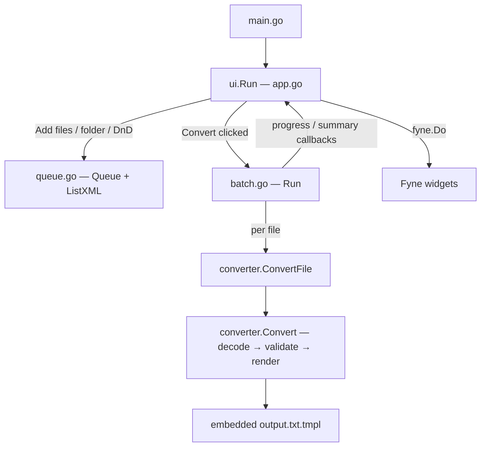

# GUI Design

**Spec**: `.specs/features/gui/spec.md`
**Context**: `.specs/features/gui/context.md`
**Status**: Draft

---

## Architecture Overview

Structure is pre-agreed (AGENTS.md is authoritative): thin `main.go`, `internal/converter` (pure conversion, owns XML structs + embedded template), `internal/ui` (Fyne shell + queue + batch). No approach exploration needed — GUI_PLAN.md already fixed the architecture; this design fills in interfaces and threading.

**Key principle:** everything below `app.go` is Fyne-free and unit-testable. Fyne types appear only in `app.go` (widgets, dialogs, `fyne.Do`). `queue.go` and `batch.go` are plain Go with callback funcs; `app.go` is the single place where callbacks get wrapped in `fyne.Do`.



### Research notes (verified 2026-07-08, pkg.go.dev + docs.fyne.io)

- Latest Fyne: **v2.7.4** (2026-05-12). Since v2.6, all Fyne callbacks run on a single goroutine; any UI mutation from another goroutine MUST go through `fyne.Do(func())`.
- `Window.SetOnDropped(func(fyne.Position, []fyne.URI))` — window-wide drop callback (since 2.4).
- `dialog.NewFileOpen(func(fyne.URIReadCloser, error), parent) *FileDialog` + `(*FileDialog).SetFilter(storage.NewExtensionFileFilter([]string{".xml"}))`.
- `dialog.NewFolderOpen(func(fyne.ListableURI, error), parent) *FileDialog` — used for both input-folder and output-folder pickers.
- `dialog.ShowInformation(title, message, parent)` / `dialog.ShowCustom(...)` for the summary.
- `fyne.io/fyne/v2/test` provides a headless toolkit (`test.NewApp()`, `test.Tap()`) — used to gate UI wiring tasks with real tests instead of manual-only checks.

---

## Code Reuse Analysis

### Existing Components to Leverage

| Component | Location | How to Use |
| --------- | -------- | ---------- |
| XML structs (`Log`, `Message`, `User`, …) | `models/input_message.go` | Move verbatim into `internal/converter/model.go` (drop top-level `models/`) |
| Output template | `templates/output.txt` | Move to `internal/converter/output.txt.tmpl`, `go:embed`, parse with `text/template` (syntax identical — content unchanged) |
| Filename logic | `main.go:50` (date `/`→`_`) | Keep, extend with Windows-illegal → `-` sanitization |
| Sample log | `files/input/example.xml` | Move to `testdata/example.xml` (currently **gitignored** via `files/**/*.xml` — the move makes it tracked, intended) |

### Integration Points

| System | Integration Method |
| ------ | ------------------ |
| Filesystem | `os.ReadDir` (folder scan), `os.Open`/`os.Create` via `filepath.Join` only |
| Fyne URIs | `uri.Path()` → absolute path; dropped URIs classified file-vs-folder via `os.Stat` |

---

## Components

### converter (package)

- **Purpose**: One MSN XML log → output filename + `.txt` content. Pure, no Fyne, never panics on input.
- **Location**: `internal/converter/` (`converter.go`, `model.go`, `output.txt.tmpl`, `converter_test.go`)
- **Interfaces**:
  - `Convert(r io.Reader) (Result, error)` — decode XML, reject zero-message logs (`ErrNoMessages`), execute embedded template, derive sanitized filename. `Result{FileName string; Content []byte}`
  - `ConvertFile(xmlPath, outDir string) (outName string, err error)` — open → `Convert` → write `filepath.Join(outDir, res.FileName)` with `os.Create` (truncates ⇒ overwrite semantics, GUI-14)
  - `ErrNoMessages` — sentinel for empty logs (GUI-03)
- **Filename rule (GUI-04)**: `date(/→_) + "_" + time + "_" + receiver`, then each of `\ / : * ? " < > |` → `-`, then `+ ".txt"`
- **Template**: `//go:embed output.txt.tmpl`, parsed once at package init with `text/template` (`template.Must` on an embedded constant is a build defect, not an input panic)
- **Dependencies**: stdlib only
- **Reuses**: structs from `models/`, template from `templates/output.txt`

### queue (internal/ui/queue.go)

- **Purpose**: Ordered, de-duplicated input file list + folder scanning. No Fyne types.
- **Interfaces**:
  - `Queue` — `Add(paths ...string) (added int)` (abs-path dedup, keeps insertion order), `Remove(path string)`, `Clear()`, `Items() []string` (snapshot copy), `Len() int`
  - `ListXML(dir string) ([]string, error)` — non-recursive, case-insensitive `.xml` match, returns absolute paths
- **Concurrency**: confined to the Fyne event goroutine (all mutations from UI callbacks); batch operates on an `Items()` snapshot — no locks needed
- **Dependencies**: stdlib only

### batch (internal/ui/batch.go)

- **Purpose**: Sequential skip-and-report batch over a snapshot. No Fyne types.
- **Interfaces**:
  - `RunBatch(files []string, outDir string, progress func(done, total int)) Summary` — calls `converter.ConvertFile` per file; failure appends `FileError{Path, Reason}` and continues (GUI-12); `progress` fires once per file processed (GUI-11)
  - `Summary{Converted int; Failed []FileError}`
- **Dependencies**: `internal/converter`

### app (internal/ui/app.go)

- **Purpose**: Fyne shell — window, layout, wiring, threading. Only file that imports Fyne widgets/dialogs.
- **Interfaces**: `Run()` — builds `app.New()`, window "MSN Converter" 600×450, `ShowAndRun()`
- **Layout** (border):
  - top: toolbar row — `[Add files] [Add folder] [Clear all]`
  - center: `widget.List` over `Queue` items, each row `filename — [✕]` (per-item remove)
  - bottom (VBox): output row `[Choose output folder…]` + path label; `widget.ProgressBar`; `[Convert]`
- **Wiring**:
  - Add files → `dialog.NewFileOpen` + `.xml` filter → `queue.Add(uri.Path())`
  - Add folder → `dialog.NewFolderOpen` → `ListXML` → `queue.Add`
  - `win.SetOnDropped` → per URI: `os.Stat`; dir → `ListXML`; file with `.xml` ext → add; else ignore (GUI-15)
  - Convert enablement (GUI-10): `queue.Len() > 0 && outDir != "" && !running` — recomputed after every mutation via one `updateConvertState()` func
  - Convert → `running = true`, disable button, `go func(){ s := RunBatch(snapshot, outDir, func(d,t){ fyne.Do(progress update) }); fyne.Do(show summary, running=false, re-enable) }()`
  - Summary: `dialog.ShowInformation` when `len(Failed)==0`, else `dialog.ShowCustom` with scrollable per-file reasons (GUI-13); queue untouched (GUI-18… spec: list kept)
- **Testing**: enablement + wiring exercised headlessly with `fyne.io/fyne/v2/test`; drop handling factored into a plain `addDropped(paths []string)` method so tests call it directly

### main.go

- **Purpose**: `func main() { ui.Run() }` — nothing else.

---

## Data Models

```go
// converter
type Result struct {
    FileName string // sanitized, e.g. "16_9_2010_22-45-43_Ricardo.txt"
    Content  []byte // rendered template output, LF endings
}

// ui
type FileError struct{ Path, Reason string }
type Summary struct {
    Converted int
    Failed    []FileError
}
```

XML structs move unchanged from `models/input_message.go` (all fields kept — `Style`, `DateTime`, `SessionID` are part of the wire format even if unused by the template).

---

## Error Handling Strategy

| Error Scenario | Handling | User Impact |
| -------------- | -------- | ----------- |
| Malformed / truncated / 0-byte XML | `Convert` returns decode error → batch records `FileError`, continues | File listed under "failed" with reason in summary |
| Log with zero messages | `ErrNoMessages` → skip-and-report | Same — fixes latent `Messages[0]` panic |
| Input file unreadable | `ConvertFile` open error → skip-and-report | Listed in summary |
| Output dir unwritable / deleted | `os.Create` error per file → skip-and-report; batch completes | All files listed as failed |
| Name clash (pre-existing or intra-batch) | `os.Create` truncates → overwrite, last write wins | Silent by design (GUI-14) |
| Picker cancelled / nil URI | Callback returns early | Nothing happens |
| Folder with zero `.xml` | `Add` of empty slice — no-op | List unchanged, no dialog |

---

## Risks & Concerns

| Concern | Location | Impact | Mitigation |
| ------- | -------- | ------ | ---------- |
| Fyne v2.6+ threading: UI touched from batch goroutine without `fyne.Do` panics/races | new `app.go` | Runtime crash mid-batch | All batch callbacks wrapped in `fyne.Do` at the single wiring point in `app.go`; lower layers are Fyne-free by construction |
| `files/**/*.xml` gitignore rule means `example.xml` is currently untracked | `.gitignore:118` | Test fixture silently missing from repo | Move to `testdata/` (not ignored) in the converter task; verify with `git status` |
| `html/template` escaping mangles chat text | `main.go:53` | Wrong `.txt` content | Switch to `text/template` (user-confirmed, AD-002) |
| `Messages[0]` panics on empty logs | `main.go:50` | Crash | `ErrNoMessages` guard (GUI-03) with test |
| Path building via string concat breaks on Windows | `main.go:20,32` | Wrong paths on target OS | `filepath.Join` everywhere; enforced by task checklists |
| CGO requirement of Fyne on macOS dev machine | build env | `go build` fails without Xcode CLT | Verify toolchain in the dependency task; surface early |

---

## Tech Decisions (only non-obvious ones)

| Decision | Choice | Rationale |
| -------- | ------ | --------- |
| Template engine | `text/template` | Output is plain text; HTML escaping corrupts messages (user-confirmed) |
| Filename sanitization | date `/`→`_`, then illegal chars → `-` | Windows-legal names, user-confirmed format |
| Layer boundary | Fyne types only in `app.go` | Queue/batch/converter unit-testable headless; single `fyne.Do` wiring point kills the threading risk class |
| Batch concurrency | One background goroutine, files sequential | Order = list order; no worker pool needed for this workload; simplest correct progress |
| Queue thread model | UI-goroutine-confined + snapshot for batch | No mutexes; mutations only happen in Fyne callbacks |
| UI test strategy | `fyne.io/fyne/v2/test` headless toolkit | Real gates for enablement/wiring instead of manual-only verification |
